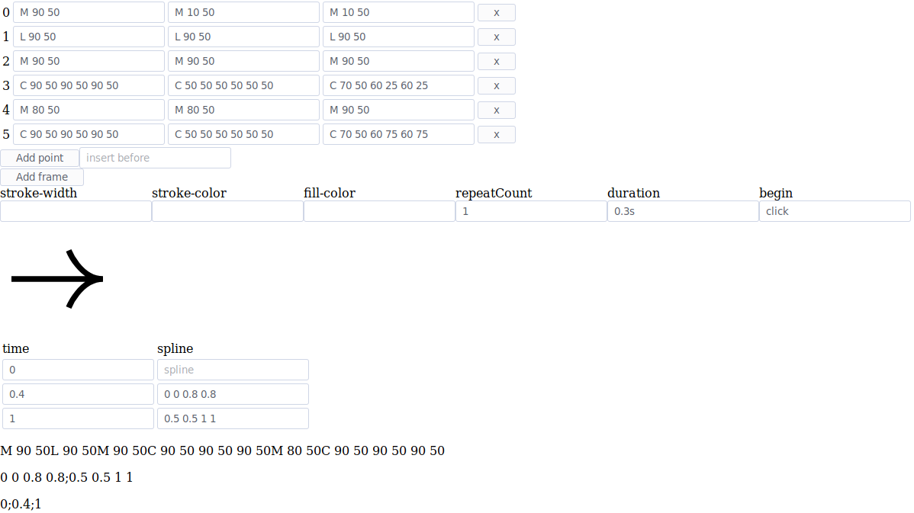

# Pathfinder

Pathfinder is a simple tool for visually creating and animating svg paths.

## Known issues
A bug in elm or firefox prevents the keyTimes and keySplines attributes from updating. To fix it,
you need to open the developer console and manually add a space to the end of those attributes
whenever you update them.
